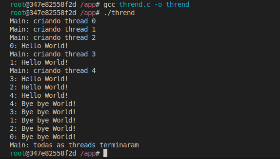
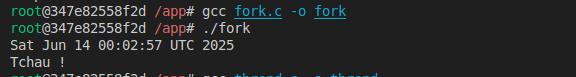

## Relatório da Prática – Compilando e Executando C com Docker

**Nome:** Flavio da Silva Matias
**Data:** 13/jun/20025

---

### **1. Objetivo**

O objetivo desta prática foi criar um ambiente isolado utilizando Docker, com as ferramentas necessárias para **compilar e executar programas em C**. A proposta inclui:

* Construir uma imagem Docker com `gcc`,
* Mapear um diretório local para o container,
* Compilar e rodar os códigos-fonte do capítulo 5 do livro texto da disciplina.

---

### **2. Passos Executados**

#### 📁 **Estrutura Inicial**

Criei uma pasta chamada `docker-c-practice`, contendo:

* `Dockerfile`
* Os códigos-fonte retirados do capítulo 5 do livro [Sistemas Operacionais – Maziero](https://wiki.inf.ufpr.br/maziero/lib/exe/fetch.php?media=socm:socm-05.pdf)

#### 🐳 **Build da imagem Docker**

```bash
docker build -t tarefas ./docker-c-practice
```

> 🔧 Essa etapa construiu a imagem chamada `tarefas` com base no `Dockerfile`.

#### ▶️ **Execução do container**

```bash
docker run -it tarefas
```

> 🚪 Entrou no container com terminal interativo.

#### 📦 **Instalação das ferramentas dentro do container**

```bash
dnf install -y gcc gcc-c++ make
```

> 🔧 Instalou os compiladores `gcc`, `g++` e o `make` dentro do Fedora do container.

#### ⚙️ **Compilação e Execução dos Programas C**

```bash
gcc nome_do_arquivo.c -o nome_do_programa
./nome_do_programa
```

> 🖥️ A compilação e execução funcionaram conforme o esperado para os exemplos fornecidos.

---

### **3. Resultados Obtidos**

* A imagem foi construída com sucesso.
* O container foi iniciado corretamente, com `gcc` e `make` funcionando.
* Os programas em C foram compilados e executados normalmente.

📸 **Imagens da execução abaixo:**
#### **Fork**

#### **Thrend**


---

### **4. Conclusão**

A prática foi eficaz para demonstrar como usar o Docker para construir um **ambiente de desenvolvimento isolado** para linguagens compiladas como C. O uso de `gcc` dentro do container proporciona controle sobre dependências, o que é útil para ambientes controlados, CI/CD, ou testes.

Além disso, usar Docker nesse contexto ajuda a manter o sistema host limpo e portátil para múltiplas plataformas e projetos. O processo também introduz noções práticas de DevOps para estudantes de sistemas operacionais.
